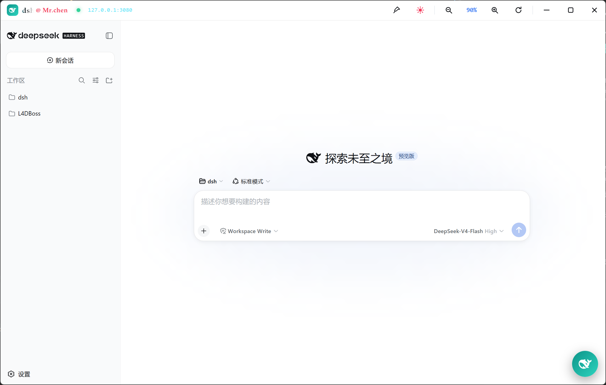
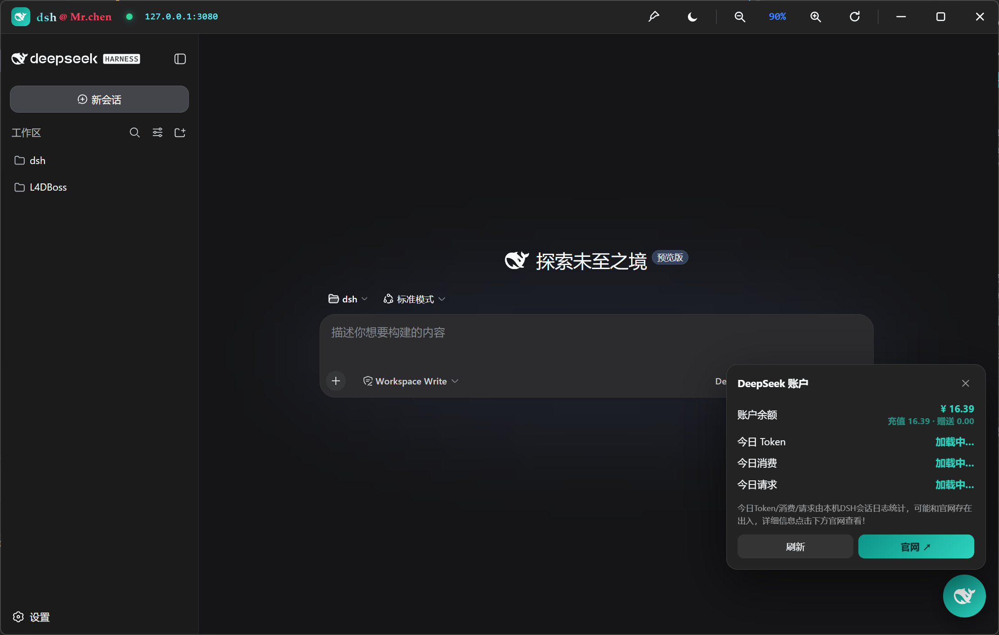
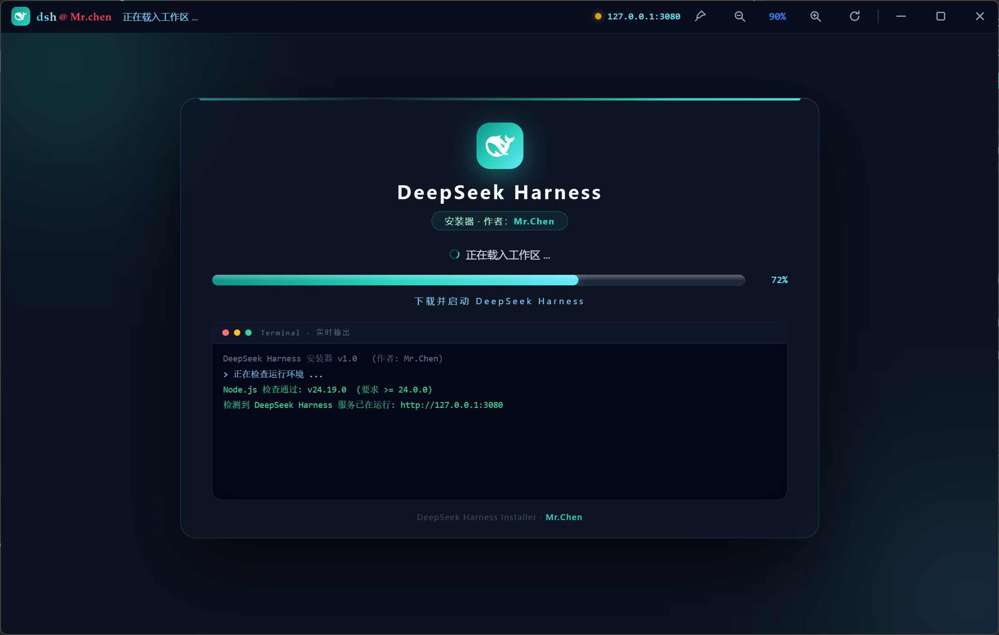

<div align="center">

# 🐋 DeepSeek Harness 安装器 / 启动器

**一键安装、启动 DeepSeek Harness 的跨平台桌面客户端**

Python · pywebview · 自绘无边框窗口 · 内嵌实时终端


</div>

---

一个开箱即用的 **DeepSeek Harness 桌面客户端**：打开程序 → 自动检查 Node.js（要求 **≥ v24**）→ 缺失或版本过低时在界面内一键安装/更新 → 自动执行 `npx @deepseek-ai/dsh web` 下载并启动 Harness → 服务就绪后**在同一个窗口**打开 Harness 页面，全程可视化进度条 + 实时终端输出。

[dsh.dist.zip](https://github.com/chenduanyun091216/dsh/releases/download/untagged-cb01fa95cfcc7315606b/dsh.dist.zip)

## ✨ 功能特性

| 类别 | 说明 |
| ---- | ---- |
| 🚀 一键安装 | 自动检测 Node.js 并引导安装/更新：Windows `winget`（失败回退官方 MSI 静默安装）、macOS `brew`、Linux `apt` |
| 🖥️ 同一窗口 | 安装界面与 Harness 页面无缝衔接，无跳转、无白闪 |
| 📊 进度 + 终端 | 全程进度条（忙碌时流动动画）+ 内嵌实时终端面板，与真实终端体验一致 |
| 🎨 自绘无边框窗口 | 自绘标题栏：鲸鱼 logo、渐变流光标题、logo 悬停动效 |
| ● 状态指示灯 | 处理中 / 就绪 / 异常三态圆点，标题栏实时显示当前阶段 |
| 🔗 服务地址 | 标题栏显示实际服务地址（可能非 3080），点击一键复制 |
| 📌 窗口置顶 | 图钉按钮随时置顶，安装 Node / 等待下载时不被其他窗口遮挡 |
| 🖱️ 右键菜单 | 复制地址 / 打开官网 / 打开数据目录 / 刷新页面 / 返回安装器 / 关于 |
| 🌓 主题跟随 | 标题栏跟随 DSH 深浅主题自动变色（直写 `settings.yaml` 由 DSH 热重载应用） |
| 🔍 内容缩放 | 50%–200% 浏览器式缩放，比例持久化 |
| 🐳 宠物面板 | 右下角挂件：账户余额（官方接口实时查询）、今日 Token / 消费 / 请求（本机日志本地估算 ≈） |
| ⚡ 性能优化 | rAF 合帧拖拽、终端日志批量合并、用量日志按 mtime 增量扫描 |

## 📸 界面预览





## 🚀 快速开始

### 环境要求

- **Python 3.8+**
- Windows 10/11（自带 WebView2 Runtime，无需额外安装）/ macOS / Linux

### 运行

```bash
# 方式一：直接运行（首次运行自动通过 pip 安装 pywebview）
python dsh_app.py

# 方式二：先手动安装依赖再运行
pip install -r requirements.txt
python dsh_app.py
```

Windows 下也可以直接**双击 `启动.bat`**。

> 首次运行会自动检查 Node.js：未安装或版本过低时会弹出询问框，选择「是」即自动安装（需几分钟，期间进度条/终端有活动即属正常）。

## 🧱 项目结构

```
dsh/
├── dsh_app.py            # 入口（薄封装，实际逻辑在 dshapp/ 包内）
├── dshapp/               # 功能模块包（由原单文件重构拆分）
│   ├── __init__.py       # 包说明 + 公共 API 再导出
│   ├── assets.py         # 静态资源：图标 / 界面 HTML / 注入 JS
│   ├── utils.py          # 通用工具：进程 / 命令 / 服务探测
│   ├── node_install.py   # Node.js 安装（winget / MSI / brew / apt）
│   ├── launcher.py       # Harness 启动（npx @deepseek-ai/dsh web）
│   ├── api.py            # JS ↔ Python 桥（pywebview js_api）
│   ├── flow.py           # 安装 / 启动主流程
│   └── gui.py            # 窗口创建与入口
├── 启动.bat              # Windows 双击启动
├── build_exe.bat         # Nuitka 打包脚本
├── test_flow.py          # 无界面全流程回归测试
├── requirements.txt      # 依赖（pywebview / zstandard）
└── README.md
```

## ✅ 测试

```bash
python test_flow.py    # 无界面全流程回归测试（11 个场景：版本检查/询问/安装/重试/退出/用量统计/标题栏 API 等）
```

## 📦 打包为 exe（可选）

<details>
<summary><b>展开查看 Nuitka 打包命令与前置补丁</b></summary>

已验证可用的最终打包命令（产物 `dist\dsh.dist\dsh.exe`，约 13 MB）：

```bat
".venv\Scripts\python.exe" -m nuitka --standalone --windows-console-mode=disable --output-filename=dsh.exe --windows-icon-from-ico=installer.ico --output-dir=dist --product-name="dsh" --company-name="Mr.Chen" --file-description="dsh - DeepSeek Harness 一键启动器 (Mr.Chen)" --file-version=1.0.0 --product-version=1.0.0 --copyright="Mr.Chen" --enable-plugin=pywebview --include-package-data=webview --include-package=pythonnet --include-package-data=pythonnet --include-module=clr --nofollow-import-to=tkinter,idlelib,test,unittest,pydoc,curses,lib2to3 --msvc=latest dsh_app.py
```

> `build_exe.bat` 内为同一命令的多行版，双击即可打包（需先 `pip install nuitka`）。

#### 前置补丁（重要！）

打包前需对 venv 内文件打补丁，**重装 Nuitka 或重建虚拟环境后必须重新打**：

**① `venv\Lib\site-packages\nuitka\plugins\standard\PywebViewPlugin.py`**

Nuitka 的 pywebview 插件在 Windows 允许列表漏了 `webview.platforms.win32`（pywebview ≥ 6 winforms 依赖它做屏幕缩放），否则报 `Module 'webview.platforms.win32' was actively excluded from Nuitka compilation`。在元组中加入：

```python
"webview.platforms.win32",  # pywebview>=6 winforms 依赖此模块(屏幕缩放)
```

**② `venv\Lib\site-packages\nuitka\build\inline_copy\clcache\clcache\caching.py`**

clcache 用系统 ANSI 代码页（mbcs）解码 cl.exe 的 UTF-8 输出，中文 Windows 必然报 `UnicodeDecodeError: 'mbcs' codec can't decode`。将 `CL_DEFAULT_CODEC = "mbcs"` 改为：

```python
CL_DEFAULT_CODEC = "utf-8"
```

**③ `venv\Lib\site-packages\webview\util.py`**

`js_bridge_call` 的 `_call` 最后投递 JS 回调的 `window.evaluate_js(...)` 无异常保护——页面导航后旧文档回调失效，高频调用在跳转瞬间抛 `JavascriptException`。包上 try/except：

```python
try:
    window.evaluate_js(
        f'window.pywebview._returnValuesCallbacks["{func_name}"]["{value_id}"]({retval})'
    )
except Exception:
    pass  # dsh patch: 页面已导航, 回调丢失, 静默忽略
```

#### 注意事项

- 使用 `--msvc=latest`（需 Visual Studio Build Tools）；**不要覆盖 TEMP 环境变量**（否则 `c1: fatal error C1083`）；
- 分发时压缩**整个 `.dist` 文件夹**为 zip（standalone 需同目录 DLL/资源），不要只发单个 exe；
- exe 图标为黑色鲸鱼（`installer.ico`，由 DSH 官方 favicon.svg 生成）；
- 目标机器要求 Win10/11（自带 WebView2）；Node.js 由程序自动安装；
- 无签名 exe 可能触发杀软启发式引擎，分发前建议上传 VirusTotal 自查。

</details>

## ❓ 常见问题

- **弹出 UAC 授权**：安装 Node.js 需要管理员权限，属正常现象；若静默安装失败，请右键「以管理员身份运行」本程序。
- **端口 3080 被占用**：检测到 Harness 服务已在运行时会直接打开已有页面，不会重复启动。
- **国内下载慢**：可先配置 npm 镜像后重试：`npm config set registry https://registry.npmmirror.com`。
- **界面打不开**：Windows 需安装 [WebView2 Runtime](https://developer.microsoft.com/microsoft-edge/webview2/)（Win10/11 一般自带）。
- **关闭即停服**：关闭窗口会自动结束由本程序启动的 `dsh web` 服务进程。

## 👤 作者

👨‍💻 **Mr.Chen**

## 📄 License

目前项目尚未附带开源许可证文件。如需公开/分发，请先自行添加 `LICENSE`（如 MIT）。
